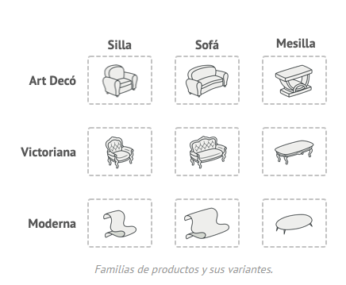
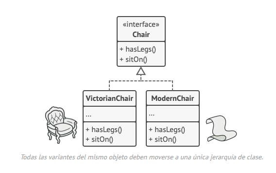
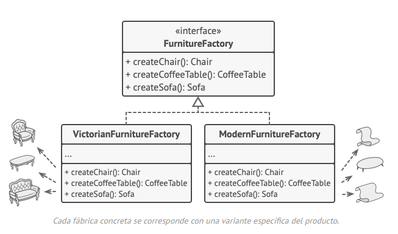

# Abstract Factory

Es un patrón de diseño creacional que nos permite producir familias de objetos relacionados sin especificar sus clases
concretas.

## Problema

Imagina que estás creando un simulador de tienda de muebles. Tu código está compuesto por clases que representan lo
siguiente:

1. Una familia de productos relacionados, digamos: `Silla` + `Sofá` + `Mesilla`
2. Algunas variantes de esta familia. Por ejemplo, los productos `Silla` + `Sofá` + `Mesilla` están disponibles en estas
   variantes: `Moderna`, `Victoriana`, `ArtDecó`.
   

Necesitamos una forma de crear objetos individuales de mobiliario para que combinen con otros objetos de la misma
familia. Los clientes se enfadan bastante cuando reciben muebles que no combinan.

Además, no queremos cambiar el código existente al añadir al programa nuevos productos o familia de productos. Los
comerciantes de muebles actualizan sus catálogos muy a menudo, y debemos evitar tener que cambiar el código principal
cada vez que esto ocurra.

## Solución

Lo primero que sugiere el patron Abstract Factory es que declaremos de forma explícita interfaces para cada producto
diferente de la familia de productos (por ejemplo, silla, sofá o mesilla). Después podemos hacer que todas las variantes
de los productos sigan esas interfaces. Por ejemplo, todas las variantes de silla pueden implementar la interfaz `Silla`
, así como todas las variantes de mesillas pueden implementar la interfaz `Mesilla`, y así sucesivamente.

El siguiente paso consiste en declarar la *Fábrica abstracta*: una interfaz con una lista de métodos de creación para
todos los productos que son parte de la familia de productos (por ejemplo, `crearSilla`, `crearSofá` y `crearMesilla`).
Estos métodos deben devolver productos **abstractos** representados por las interfaces que extrajimos
previamente: `Silla`, `Sofá`, `Mesilla`, etc.

Ahora bien, ¿qué hay de las variantes de los productos? Para cada variante de una familia de productos, creamos una
clase de fábrica independiente basada en la interfaz `FábricaAbstracta`. Una fábrica es una clase que devuelve productos
de un tipo particular. Por ejemplo, la `FábricaMueblesModernos` sólo puede crear objetos de `SillaModerna`
, `SofáModerno` y `MesillaModerna`.

El código cliente tiene que funcionar con fábricas y productos a través de sus respectivas interfaces abstractas. Esto
nos permite cambiar el tipo de fábrica que pasamos al código cliente, asñi como la variante del producto que recibe el
código cliente, sin descomponer el propio código cliente.

Digamos que el cliente quiere una fábrica para producir una silla. El cliente no tiene que conocer la clase de la
fábrica y tampoco importa el tipo de silla que obtiene. Ya sea un modelo moderno o una silla de estilo victoriano, el
cliente debe tratar a todas las sillas del mismo modo, utilizando la interfaz abstracta `Silla`. Con este sistema, lo
único que sabe el cliente sobre la silla es que implemneta de algún modo el método `sentarse`. Además, sea cual sea la
variante de silla devuelta, siempre combinará con el tipo de sofá o mesilla producida por el mismo objeto de fábrica.

Queda otro punto por aclarar: si el cleinte sólo está expuesto a las interfaces abstractas, ¿cómo se crean los objetos
de fábrica?
Normalmente, la aplicación debe seleccionar el tipo de fábrica, dependiendo de la configuración o de los ajustes del
entorno.

## Estructura

## Aplicabilidad

🪲 Utiliza el patrón Abstract Factory cuando tu código deba funcionar con varias familias de productos relacionados, pero
no desees que dependa de las clases concretas de esos productos, ya que puede ser que no los conozcas de antemano o
sencillamente quieras permitir una futura extensibilidad.

⛈️ El patrón Abstract Factory nos ofrece una interfaz para crear objetos a partir de cada clase de la familia de
productos.
Mientras tu código cree objetos a través de esta interfaz, no tendrás que preocuparte por crear la variante errónea de
un producto que no combine con los productos que ya ha creado tu aplicación.

- Considera la implementación del patrón Abstract Factory cuando tengas una clase con un grupo de métodos de fábrica que
  nublen su responsabilidad principal.

- En un programa bien diseñado cada clase es responsable tan solo de una cosa. Cuando una clase lidia con varios tipos
  de
  productos, puede ser que valga la pena extraer sus métodos de fábrica para ponerlos en una clase única de fábrica o
  una
  implementación completa del patrón Abstract Factory.

## Cómo implementarlo

1. Mapea una matriz de distintos tipos de productos frente a variantes de dichos productos.

2. Declara interfaces abstractas de producto para todos los tipos de productos. Después haz que todas las clases
   concretas
   de productos implementen esas interfaces.

3. Declara la interfaz de la fábrica abstracta con un grupo de métodos de creación para todos los productos abstractos.

4. Implementa un grupo de clases concretas de fábrica, una por cada variante de producto.

5. Crea un código de inicialización de la fábrica en algún punto de la aplicación. Deberá instanciar una de las clases
   concretas de la fábrica, dependiendo de la configuración de la aplicación o del entorno actual. Pasa este objeto de
   fábrica a todas las clases que construyen productos.

6. Explora el código y encuentra todas las llamadas directas a constructores de producto. Sustitúyelas por llamadas al
   método de creación adecuado dentro del objeto de fábrica.

## Pros y contras

✅ Puedes tener la certeza de que los productos que obtienes de una fábrica son compatibles entre sí.
✅ Evitas un acoplamiento fuerte entre productos concretos y el código cliente.
✅ Principio de responsabilidad única. Puedes mover el código de creación de productos a un solo lugar, haciendo que el
código sea más fácil de mantener.
✅ Principio de abierto/cerrado. Puedes introducir nuevas variantes de productos sin descomponer el código cliente
existente.
❌ Puede ser que el código se complique más de lo que debería, ya que se introducen muchas nuevas interfaces y clases
junto
al patrón.

## Relaciones con otros patrones

- Muchos diseños empiezan utilizando el **Factory Method** (menos complicado y más personalizable mediante las
  subclases) y
  evolucionan hacia **Abstract Factory, Prototype**, o **Builder** (más flexibles, pero más complicados).

- **Builder** se enfoca en construir objetos complejos, paso a paso. **Abstract Factory** se especializa en crear
  familias de
  objetos relacionados. Abstract Factory devuelve el producto inmediatamente, mientras que Builder te permite ejecutar
  algunos pasos adicionales de construcción antes de extraer el producto.

- Las clases del **Abstract Factory** a menudo se basan en un grupo de **métodos de fábrica**, pero también puedes
  utilizar
  **Prototype** para escribir los métodos de estas clases.

- **Abstract Factory** puede servir como alternativa a **Facade** cuando tan solo deseas esconder la forma en que se
  crean los
  objetos del subsistema a partir del código cliente.

- Puedes utilizar **Abstract Factory** junto a **Bridge**. Este emparejamiento resulta útil cuando algunas abstracciones
  definidas
  por Bridge sólo pueden funcionar con implementaciones específicas. En este caso, Abstract Factory puede encapsular
  estas
  relaciones y esconder la complejidad al código cliente.

- Los patrones **Abstract Factory, Builder** y **Prototype** pueden todos ellos implementarse como Singletons.