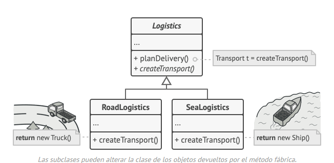
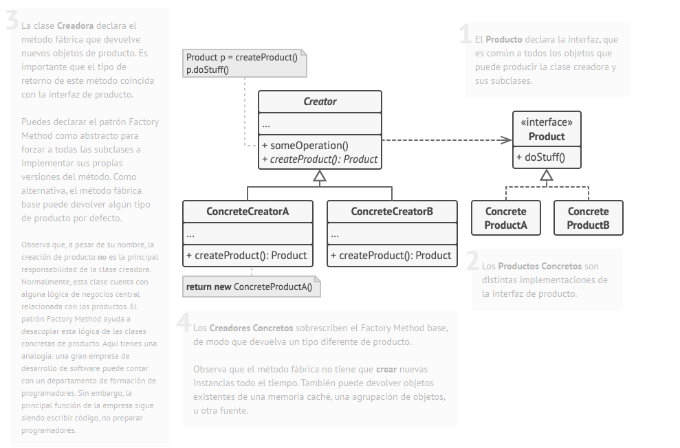
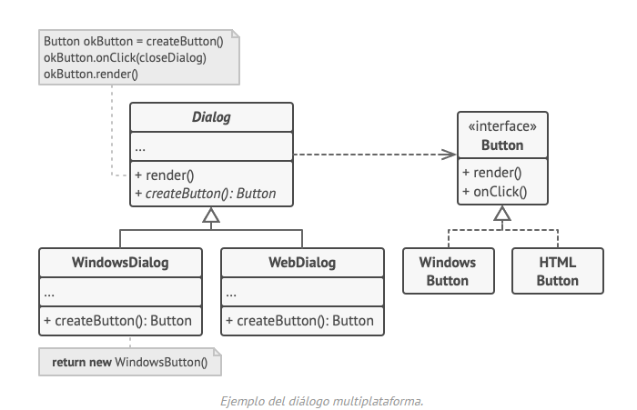

# Factory method

Es un patrón de diseño creacional que proporciona una interfaz para crear objetos en una superclase, mientras permite a
las subclases alterar el tipo de objetos que se crearán.

## Problema

Imagina que estás creando una aplicación de gestión logística. La primera versión de tu aplicación sólo es capaz de
manejar el transporte en camión, por lo que la mayor parte de tu código se encuentra dentro de la clase `Camión`.

Al cabo de un tiempo, tu aplicación se vuelve bastante popular. Cada día recibes decenas de peticiones de empresas de
transporte marítimo para que incorpores la logística por mar a la aplicación.

Estupendo, ¿verdad? Pero, ¿qué pasa con el código? En este momento, la mayor parte de tu código está acoplado a la
clase `Camión`. Para añadir barcos a la aplicación habría que hacer cambios en toda la base del código. Además, si más
tarde decides añadir otro tipo de transporte a la aplicación, probablemente tendrás que volver a hacer todos estos
cambios.

Al final acabarás con un código bastante sucio, plagado de condicionales que cambian el comportamiento de la aplicación
dependiendo de la clase de los objetos de transporte.

## Solución

El patrón Factory Method sugiere que, en lugar de llamar al operador `new` para construir objetos directamente, se
invoque a un método *fábrica* especial. No te preocupes: los objetos se siguen creando a través del operador `new`,
pero se invocan desde el método fábrica. Los objetos devueltos por el método fábrica a menudo se denominan *productos*.

A simple vista, puede parecer que este cambio no tiene sentido, ya que tan solo hemos cambiado el lugar desde donde
invocamos al constructor. Sin embargo, piensa en esto: ahora puedes sobreescribir el método fábrica en una subclase y
cambiar la clase de los productos creados por el método.

No obstante, hay una pequeña limitación: las subclases sólo pueden devolver productos de distintos tipos si dichos
productos tienen una clase base o interfaz común. Además, el método fábrica en la clase base debe tener su tipo de
retorno declarado como dicha interfaz.

Por ejemplo, tanto en la clase `Camión` como la clase `Barco` deben implementar la interfaz `Transporte`, que declara un
método llamado `entrega`. Cada clase implementa este método de forma diferente: los camiones entregan sus cargas por
tierra, mientras que los barcos lo hacen por el mar. El método fábrica dentro de la clase `LogísticaTerrestre` devuelve
objetos de tipo camión, mientras que el método fábrica de la clase `LogísticaMarina` devuelve barcos.

El código que utiliza el método fábrica (a menudo denominado código cliente) no encuentra diferencias entre los
productos devueltos por varias subclases, y trata a todos los productos como la clase abstracta `Transporte`. El cliente
sabe que todos los objetos de transporte deben tener el método `entrega`, pero no necesita saber cómo funciona
exactamente.

## Estructura

## Pseudocódigo

Este ejemplo ilustra cómo puede utilizarse el patrón **Factory Method** para crear elementos de interfaz de usuario (UI)
multiplataforma sin acoplar el código cliente a clases UI concretas.

La clase base de diálogo utiliza distintos elementos UI para representar su ventana. En varios sistemas operativos,
estos elementos pueden tener aspectos diferentes, pero su comportamiento debe ser consistente. Un botón en Windows sigue
siendo un botón en Linux.

Cuando entra en juego el patrón Factory Method no hace falta reescribir la lógica del diálogo para cada sistema
operativo. Si declaramos un patrón Factory Method que produce botones dentro de la clase base de diálogo, más tarde
podremos crear una subclase de diálogo que devuelva botones al estilo de Windows desde el Factory Method. Entonces la
subclase hereda la mayor parte del código del diálogo de la clase base, pero, gracias al Factory Method, puede
representar botones al estilo de Windows en pantalla.

Para que este patrón funcione, la clase base de diálogo debe funcionar con botones abstractos, es decir, una clase base
o una interfaz que sigan todos los botones concretos. De este modo, el código sigue siendo funcional, independientemente
del tipo de botones con el que trabaje.

Por supuesto, también se puede aplicar este sistema a otros elementos UI. Sin embargo, con cada nuevo método de fábrica
que añadas al diálogo, más te acercarás al patrón **Abstract Factory**. No temas, más adelante hablaremos sobre este
patrón.

## Aplicabilidad

- 🪲 **Utiliza el Método Fábrica cuando no conozcas de antemano las dependencias y los tipos exactos de los objetos con
  los
  que deba funcionar tu código**

- ⛈️ El patrón Factory Method separa el código de construcción de producto del código que hace uso del producto. Por
  ello,
  es más fácil extender el código de construcción de producto de forma independiente al resto del código.

Por ejemplo, para añadir un nuevo tipo de producto a la aplicación, sólo tendrás que crear una nueva subclase creadora y
sobrescribir el Factory Method que contiene.

- 🪲 **Utiliza el Método Fábrica cuando quieras ofrecer a los usuarios de tu biblioteca o framework, una forma de
  extender sus componentes internos**
- ⛈️ La herencia es probablemente la forma más sencilla de extender el comportamiento por defecto de una biblioteca o un
  framework. Pero, ¿cómo reconoce el framework si debe utilizar tu subclase en lugar de un componente estándar?

La solución es reducir el código que construye componentes en todo el framework a un único patrón Factory Method y
permitir que cualquiera sobreescriba este método además de extender el propio componente.

Veamos cómo funcionaría. Imagina que escribes una aplicación utilizando un framework de UI de código abierto. Tu
aplicación debe tener botones redondos, pero el framework sólo proporciona botones cuadrados. Extiendes la clase
estándar `Botón` con una maravillosa subclase `BotónRedondo`, pero ahora tienes que decirle a la clase
principal `FrameworkUI` que utilice la nueva subclase de botón en lugar de la clase por defecto.

Para conseguirlo, creamos una subclase `UIConBotonesRedondos` a partir de una clase base del framework y sobreescribimos
su método `crearBotón`. Si bien este método devuelve objetos `Botón` en la clase base, haces que tu subclase devuelva
objetos `BotónRedondo`. Ahora, utiliza la clase `UIConBotonesRedondos` en lugar de `FrameworkUI`. ¡Eso es todo!

- 🪲 **Utiliza el Factory Method cuando quieras ahorrar recursos del sistema mediante la reutilización de objetos
  existentes en lugar de reconstruirlos cada vez.**
- ⛈️ A menudo experimentas esta necesidad cuando trabajas con objetos grandes y que consumen muchos recursos, como
  conexiones de bases de datos, sistemas de archivos y recursos de red.

Pensemos en lo que hay que hacer para reutilizar un objeto existente:

1. Primero, debemos crear un almacenamiento para llevar un registro de todos los objetos creados.
2. Cuando alguien necesite un objeto, el programa deberá buscar un objeto disponible dentro de ese agrupamiento.
3. … y devolverlo al código cliente.
4. Si no hay objetos disponibles, el programa deberá crear uno nuevo (y añadirlo al agrupamiento).
   ¡Eso es mucho código! Y hay que ponerlo todo en un mismo sitio para no contaminar el programa con código duplicado.

Es probable que el lugar más evidente y cómodo para colocar este código sea el constructor de la clase cuyos objetos
intentamos reutilizar. Sin embargo, un constructor siempre debe devolver nuevos objetos por definición. No puede
devolver instancias existentes.

Por lo tanto, necesitas un método regular capaz de crear nuevos objetos, además de reutilizar los existentes. Eso suena
bastante a lo que hace un patrón Factory Method.

## Cómo implementarlo

1. Haz que todos los productos sigan la misma interfaz. Esta interfaz deberá declarar métodos que tengan sentido en
   todos los productos.
2. Añade un patrón Factory Method vacío dentro de la clase creadora. El tipo de retorno del método deberá coincidir con
   la interfaz común de los productos.
3. Encuentra todas las referencias a constructores de producto en el código de la clase creadora. Una a una,
   sustitúyelas por invocaciones al Factory Method, mientras extraes el código de creación de productos para colocarlo
   dentro del Factory Method.

Puede ser que tengas que añadir un parámetro temporal al Factory Method para controlar el tipo de producto devuelto.
A estas alturas, es posible que el aspecto del código del Factory Method luzca bastante desagradable. Puede ser que
tenga un operador `switch` largo que elige qué clase de producto instanciar. Pero, no te preocupes, lo arreglaremos
enseguida.

4. Ahora, crea un grupo de subclases creadoras para cada tipo de producto enumerado en el Factory Method. Sobreescribe
   el Factory Method en las subclases y extrae las partes adecuadas de código constructor del método base.
5. Si hay demasiados tipos de producto y no tiene sentido crear subclases para todos ellos, puedes reutilizar el
   parámetro de control de la clase base en las subclases.

Por ejemplo, imagina que tienes la siguiente jerarquía de clases: la clase base `Correo` con las subclases `CorreoAéreo`
y `CorreoTerrestre` y la clase `Transporte` con `Avión`, `Camión` y `Tren`. La clase `CorreoAéreo` sólo utiliza
objetos `Avión`, pero `CorreoTerrestre` puede funcionar tanto con objetos `Camión`, como con objetos `Tren`. Puedes
crear una nueva subclase (digamos, `CorreoFerroviario`) que gestione ambos casos, pero hay otra opción. El código
cliente puede pasar un argumento al Factory Method de la clase `CorreoTerrestre` para controlar el producto que quiere
recibir.

6. Si, tras todas las extracciones, el Factory Method base queda vacío, puedes hacerlo abstracto. Si queda algo dentro,
   puedes conventirlo en un comportamiento por defecto del método.

## Pros y contras

- ✅ Evitas un acoplamiento fuerte entre el creador y los productos concretos.
- ✅ *Principio de responsabilidad única*. Puedes mover el código de creación de producto a un lugar del programa,
  haciendo que el código sea más fácil de mantener.
- ✅ *Principio de abierto/cerrado*. Puedes incorporar nuevos tipos de productos en el programa sin descomponer el código
  cliente existente.
- ❌ Puede ser que el código se complique, ya que debes incorporar una multitud de nuevas subclases para implementar el
  patrón. La situación ideal sería introducir el patrón en una jerarquía existente de clases creadoras.

## Relaciones con otros patrones

- Muchos diseños empiezan utilizando el **Factory Method** (menos complicado y más personalizable mediante las
  subclases) y
  evolucionan hacia **Abstract Factory, Prototype,** o **Builder** (más flexibles, pero más complicados).

- Las clases del **Abstract Factory** a menudo se basan en un grupo de **métodos de fábrica**, pero también puedes
  utilizar
  Prototype para escribir los métodos de estas clases.

- Puedes utilizar el patrón Factory Method junto con el Iterator para permitir que las subclases de la colección
  devuelvan
  distintos tipos de iteradores que sean compatibles con las colecciones.

- Prototype no se basa en la herencia, por lo que no presenta sus inconvenientes. No obstante, Prototype requiere de una
  inicialización complicada del objeto clonado. Factory Method se basa en la herencia, pero no requiere de un paso de
  inicialización.

- Factory Method es una especialización del Template Method. Al mismo tiempo, un Factory Method puede servir como paso
  de
  un gran Template Method.